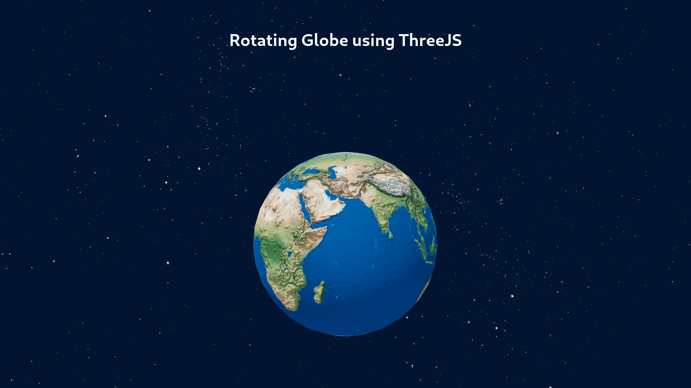

# Rotating Globe :earth_africa:

| Table Of Contents       | link          |
| ----------------------- | ------------- |
| About 🔍                 | [here](#1)    | 
| Running 🛠️               | [here](#2)    |
| Live Version            | [here](#https://vadimasko.github.io/threeJS-earth-globe/) |

## About 🔍 
Rotating Globe made using these dependencies: 
 - three.js
 - react-three-fiber
 - react-three/drei

## Running 🛠️ 

| Script        | Description                  |
| ------------- | ---------------------------- |
| `npm start`   | Runs app in development mode |
| `npm test`    | Launches the test runner     |
| `npm build`   | Builds app for production    |
| `npm deploy`  | Deploys app using gh-pages   |
